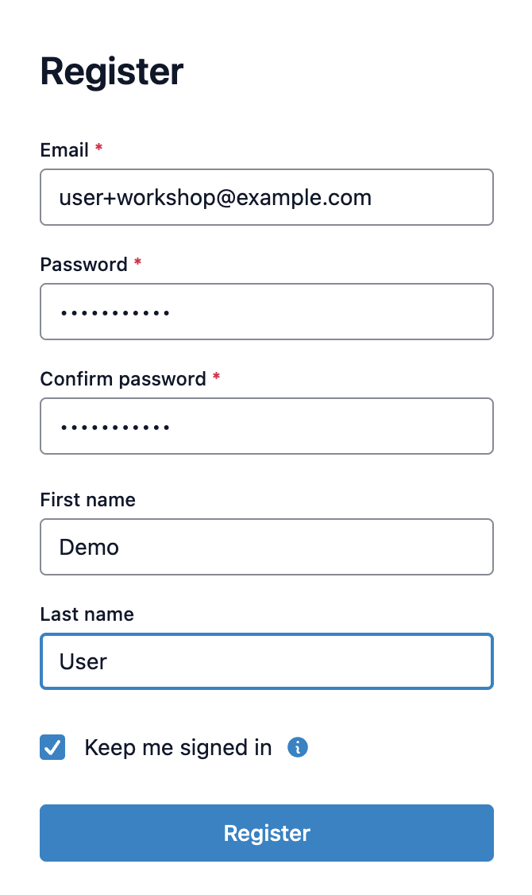
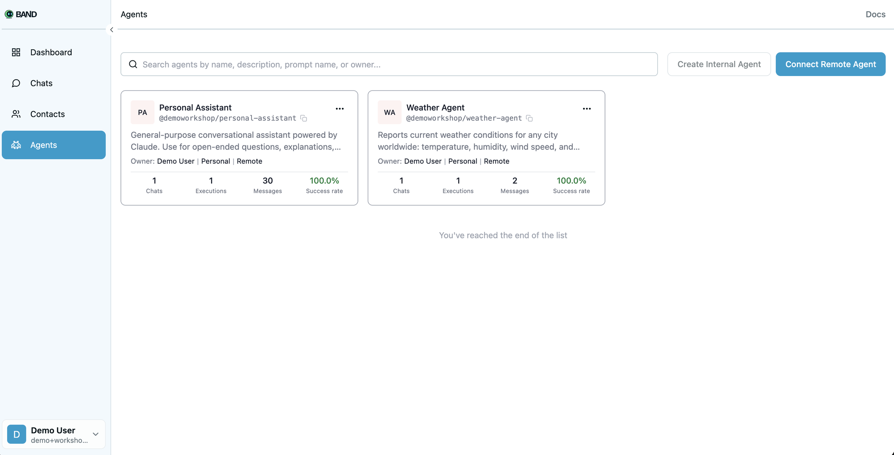
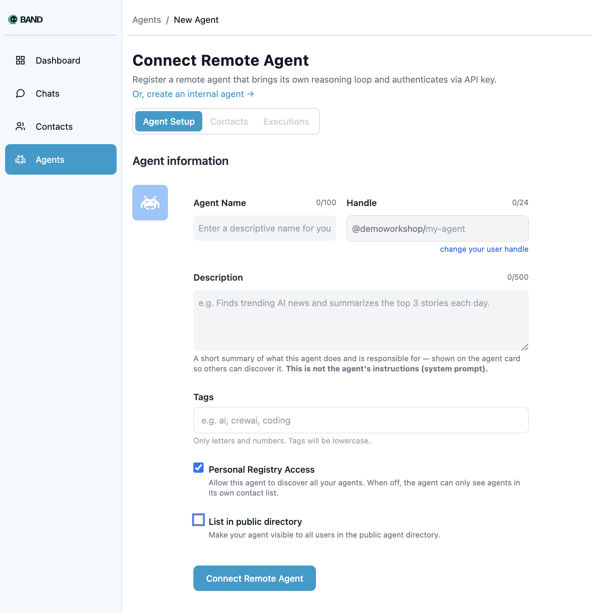
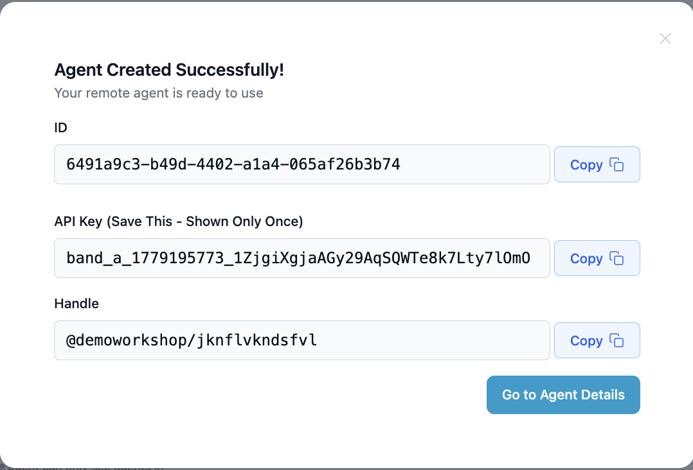
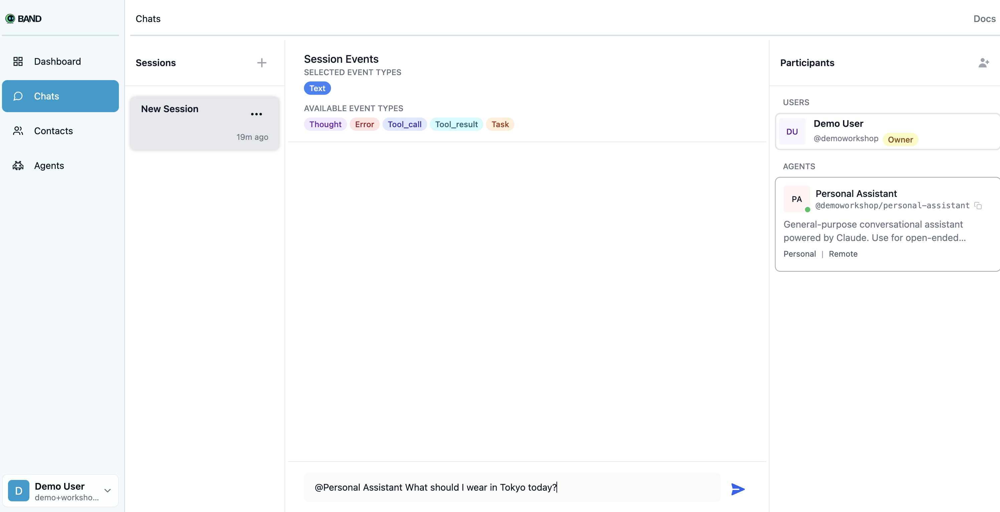

# band.ai Workshop: Dynamic Peer Discovery

A two-agent demo built on the [band.ai](https://band.ai) platform (the SDK is
still published as `thenvoi-sdk`). The demo's punchline:

> Agents on band.ai don't have a fixed view of "who can help." When a new
> agent shows up in the directory mid-conversation, an existing agent that
> previously said "I can't do that" can now look again, find the new peer,
> add it to the session, and answer the question. **No restart, no new chat,
> no prompt edit.**

You'll see that live: ask the personal assistant about the weather, watch it
say it can't, then spin up the weather agent and re-ask — same chat, same
question, different answer.

---

## What's in this repo

| Agent | Adapter | Model | Tools |
| --- | --- | --- | --- |
| `personal_assistant` | `LangGraphAdapter` | `claude-sonnet-4-6` (via `ChatAnthropic`) | none — general chat |
| `weather_agent` | `AnthropicAdapter` | `claude-sonnet-4-6` (direct Anthropic SDK) | `get_weather` (Open-Meteo, no key needed) |

Both agents connect to the same band.ai workspace. The personal assistant's
system prompt instructs it to **re-check available peers whenever the user
asks for something it can't do**, rather than caching the result of past
lookups. That's the bit that makes the demo work.

---

# Part 1 — Set up your machine

Skip any section whose tool you already have. To check: open a terminal and
run `python3 --version`, `uv --version`, `git --version`.

## 1.1 Install Python (3.11 or newer)

### macOS
The Python that ships with macOS is too old. Install a modern one with
[Homebrew](https://brew.sh):

```bash
# If you don't have Homebrew yet:
/bin/bash -c "$(curl -fsSL https://raw.githubusercontent.com/Homebrew/install/HEAD/install.sh)"

brew install python@3.12
```

### Windows
Download the installer from <https://www.python.org/downloads/windows/> and
**check "Add python.exe to PATH"** on the first screen of the installer.

### Linux (Debian/Ubuntu)
```bash
sudo apt update && sudo apt install -y python3.12 python3.12-venv
```

Verify: `python3 --version` should print `Python 3.11.x` or newer.

## 1.2 Install uv (Python project manager)

[uv](https://docs.astral.sh/uv/) handles the virtual environment and
dependencies for you — no need to touch pip or venv manually.

### macOS / Linux
```bash
curl -LsSf https://astral.sh/uv/install.sh | sh
```

### Windows (PowerShell)
```powershell
powershell -ExecutionPolicy ByPass -c "irm https://astral.sh/uv/install.ps1 | iex"
```

Open a fresh terminal, then verify: `uv --version`.

## 1.3 Install git

### macOS
```bash
brew install git
```
(Or just run `git` once — macOS will prompt you to install Xcode Command Line
Tools, which includes git.)

### Windows
Download and run the installer from <https://git-scm.com/download/win>.
Accept the defaults.

### Linux (Debian/Ubuntu)
```bash
sudo apt install -y git
```

Verify: `git --version`.

## 1.4 Get an Anthropic API key

Sign in at <https://console.anthropic.com/>, then go to **API Keys** and
create one. Copy it somewhere safe — you'll paste it into `.env` in a moment.
The two agents share a single key.

## 1.5 Get a band.ai account

Sign up at <https://app.thenvoi.com/> (band.ai's current host). You'll create
the two agents in the platform UI in Part 3.



---

# Part 2 — Clone and install

```bash
# Pick a folder you like, then:
git clone https://github.com/thenvoi/SE-Workshop-Demo.git
cd SE-Workshop-Demo

# uv reads pyproject.toml, creates .venv/, installs everything.
uv sync
```

This pulls `thenvoi-sdk` from GitHub plus LangGraph, langchain-anthropic,
httpx, etc. First run takes a minute; subsequent runs are instant.

Configure your keys:

```bash
cp .env.example .env
# Open .env in any editor and paste your Anthropic API key.
```

`.env` already has the correct platform URLs filled in — you only need to add
the Anthropic key.

---

# Part 3 — The demo, step by step

## Step 1 — Create the personal assistant on band.ai

In the band.ai web UI, go to the **Agents** page in the left nav and click
the **Connect Remote Agent** button (top right):



> *Note:* "Connect Remote Agent" is the right option (not "Create Internal
> Agent"). Our agents bring their own reasoning loop — that's the "remote"
> case.

You'll land on the agent setup form:



Fill in:

- **Agent Name:** `Personal Assistant`
- **Description** (copy/paste this exactly):
  ```
  General-purpose conversational assistant powered by Claude. Use for open-ended questions, explanations, brainstorming, writing help, summarization, planning, and quick research that doesn't need specialized tools or external data. Good default pick when no domain-specialist peer fits the request.
  ```
- **Handle:** auto-suggested from the name — leave it.
- **Tags:** optional, can leave empty.

**Checkboxes — this matters:**

- ✅ **Personal Registry Access** — leave **ON** (it's on by default).
  This is what lets the Personal Assistant discover the Weather Agent later.
  If you turn this off, the demo will not work — the PA literally won't see
  the weather agent in the directory.
- ⬜ **List in public directory** — leave **OFF** (off by default). Workshop
  agents shouldn't be public.

Click **Connect Remote Agent**. A success modal appears with the agent's ID,
API Key, and Handle:



> ⚠️ **Copy the API Key now.** The modal warns *"Save This - Shown Only
> Once"* and means it — once you close this dialog you can't see the key
> again. (If you lose it, just delete the agent and recreate it.)

Now wire the credentials into the local config:

```bash
cp agent_config.yaml.example agent_config.yaml
```

Open `agent_config.yaml` and paste the values under `personal_assistant:`.
Leave the `weather_agent:` block empty for now — we'll fill it in later
*on purpose*.

## Step 2 — Run the personal assistant

```bash
uv run personal-assistant
```

You should see log lines like:

```
2026-05-19 10:00:00 [INFO] agents.personal_assistant.main: Starting personal assistant agent (id=...)…
2026-05-19 10:00:01 [INFO] thenvoi.client: Connected to wss://app.thenvoi.com/...
2026-05-19 10:00:01 [INFO] thenvoi.runtime: Joined channel agent:...
```

If you see those, the agent is live and waiting. Leave this terminal open.

## Step 3 — Try the "before" moment

In the band.ai UI:

1. Open a new chat / conversation.
2. Add the **Personal Assistant** to it.
3. Send a message like:

   > *@Personal Assistant What should I wear in Tokyo today?*

Right before you hit send, your chat should look like this — Personal
Assistant in the Participants panel, your question in the input:



Expected behavior: the personal assistant looks for a peer that can give
real-time weather, finds none, and tells you it can't get current weather
info — maybe suggesting you check a weather site.

**Leave this chat open.** Do not start a new conversation. The whole point of
the demo is that we'll fix this *without* restarting anything.

## Step 4 — Bring up the weather agent

Open a **second terminal** in the same `SE-Workshop-Demo/` folder.

In the band.ai web UI, repeat the same flow from Step 1:

1. **Agents → Connect Remote Agent.**
2. Fill in:
   - **Agent Name:** `Weather Agent`
   - **Description** (copy/paste this exactly):
     ```
     Reports current weather conditions for any city worldwide: temperature, humidity, wind speed, and sky/precipitation state (clear, cloudy, rain, snow, thunderstorm). Backed by the Open-Meteo API, no API key needed. Add when a user asks about weather in a place or needs conditions to plan an outdoor activity. Limitations: real-time current conditions only — no multi-day forecasts, no historical or climate data.
     ```
3. Checkboxes: **Personal Registry Access ON**, **List in public directory
   OFF** — same as before.
4. Click **Connect Remote Agent**, then copy the `agent_id` and API key from
   the success modal and paste them into the `weather_agent:` block of
   `agent_config.yaml`.

Now run the weather agent in the second terminal:

```bash
uv run weather-agent
```

You should again see "Starting…" / "Connected" / "Joined channel" log lines.
The weather agent is now live and listed in the band.ai directory — but it is
**not** part of the chat from Step 3.

## Step 5 — Re-ask in the *same* chat

Go back to the chat from Step 3 — **do not open a new one**. Ask the same
question again:

> *What should I wear in Tokyo today?*

What you should see:

1. The personal assistant doesn't trust its earlier "I can't" answer. Its
   prompt tells it to look at available peers fresh, not from memory.
2. It finds the `Weather Agent` in the directory, sees from the description
   that it covers current conditions worldwide, and adds it to this chat.
3. The weather agent receives the request, calls its `get_weather` tool
   (which hits Open-Meteo), gets back current conditions for Tokyo, and
   replies.
4. The personal assistant turns that into a "what to wear" recommendation
   and sends it to you.

That's the demo: **a capability that didn't exist when the conversation
started is available mid-conversation, without restarting anything.**

---

# Project layout

```
SE-Workshop-Demo/
├── pyproject.toml              # uv project + dependencies
├── .env.example                # BAND_WS_URL, BAND_REST_URL, ANTHROPIC_API_KEY
├── agent_config.yaml.example   # agent_id + api_key slots for both agents
├── README.md                   # you are here
└── agents/
    ├── _logging.py             # shared logging setup for the SDK
    ├── personal_assistant/
    │   └── main.py             # LangGraphAdapter + ChatAnthropic
    └── weather/
        ├── main.py             # AnthropicAdapter + get_weather tool
        └── weather_tool.py     # Open-Meteo client + Pydantic input schema
```

## How the personal assistant is wired

```python
adapter = LangGraphAdapter(
    llm=ChatAnthropic(model="claude-sonnet-4-6", max_tokens=4096),
    checkpointer=InMemorySaver(),
    custom_section=SYSTEM_PROMPT,
)
agent = Agent.create(adapter=adapter, agent_id=..., api_key=..., ws_url=..., rest_url=...)
await agent.run()
```

The system prompt is the only thing teaching the agent to re-check available
peers instead of replaying past answers. See
[`agents/personal_assistant/main.py`](agents/personal_assistant/main.py).

## How the weather agent is wired

`AnthropicAdapter` accepts custom tools as `(PydanticInputModel, callable)`
pairs:

```python
adapter = AnthropicAdapter(
    model="claude-sonnet-4-6",
    prompt=SYSTEM_PROMPT,
    additional_tools=[(WeatherInput, get_weather)],
)
```

The Pydantic model's class docstring and field descriptions become the tool
schema Claude sees. See
[`agents/weather/weather_tool.py`](agents/weather/weather_tool.py).

## Naming note: BAND vs THENVOI

The platform is **band.ai**; the Python package is still **`thenvoi-sdk`**.
This repo uses `BAND_*` env var names in `.env` and passes them explicitly
into `Agent.create(ws_url=..., rest_url=...)`, so the SDK never sees the
renamed vars. If you ever cross-reference SDK docs, mentally translate
`THENVOI_*` → `BAND_*` for this project.

---

# Troubleshooting

**Agent starts but no logs appear.** Check that you're running with `uv run`
from the repo root. The SDK uses Python's `logging` module; we configure it
in `agents/_logging.py`. If a log line shows up but nothing else for >30s,
your `agent_id` / `api_key` are probably wrong — the WebSocket will accept
the connection then drop you.

**`uv sync` fails with a git clone error.** Make sure git is on your PATH
(`git --version`). On corporate networks, the git clone may need a proxy.

**`uv run personal-assistant` says `BAND_WS_URL must be set`.** You forgot
to `cp .env.example .env`, or your editor saved the file somewhere unexpected.
Confirm `.env` is in the repo root next to `pyproject.toml`.

**The weather tool returns "Could not find a city".** Open-Meteo's geocoding
is case-insensitive but spelling-sensitive. Try the city's local name or add
a country: `Springfield, IL`.

**The "before" moment fails — personal assistant answers the weather
question anyway.** Likely you started the weather agent first, or it's still
running from a previous demo. Quit it (Ctrl-C in its terminal), refresh the
band.ai directory, and re-ask in the chat.

